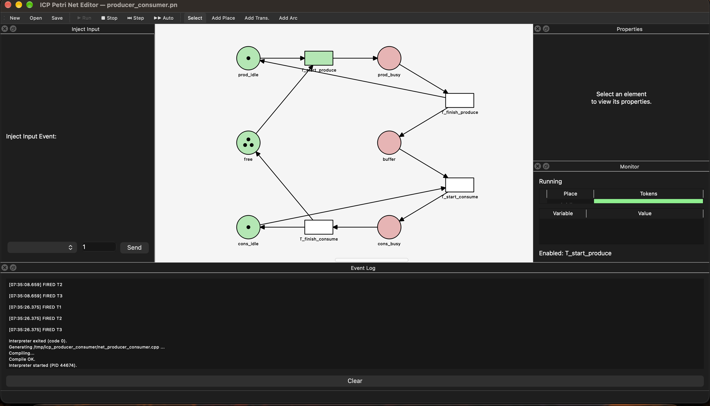
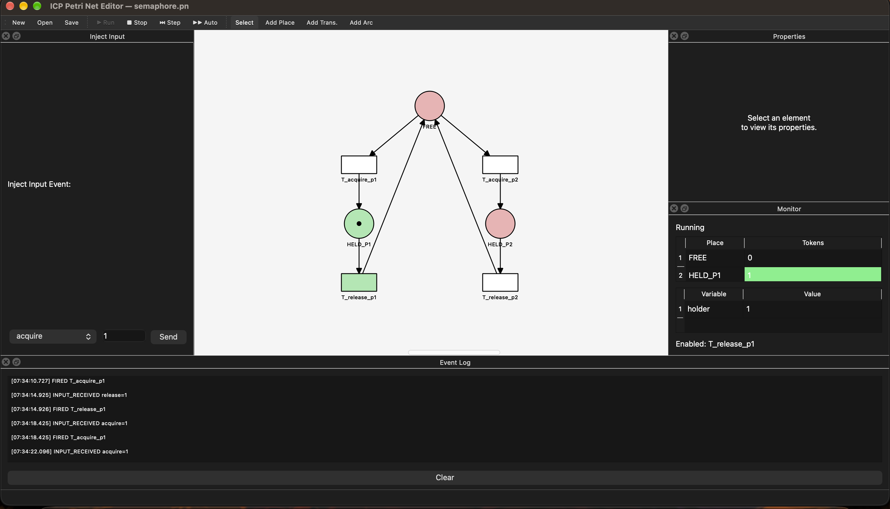
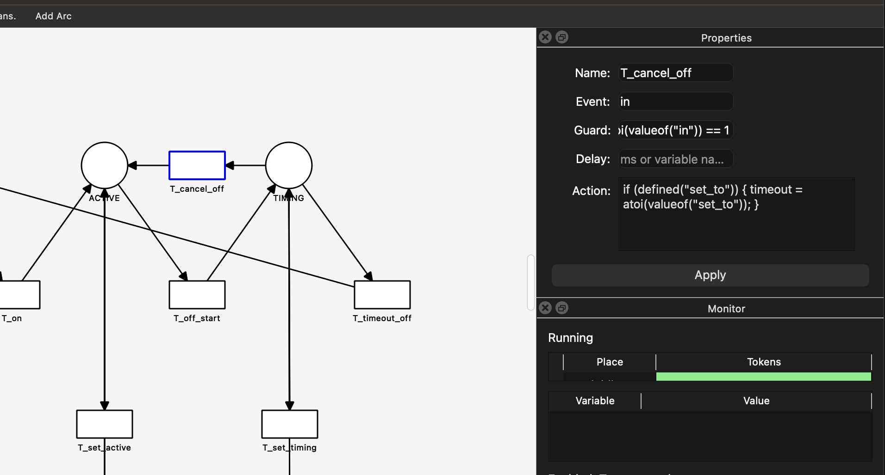
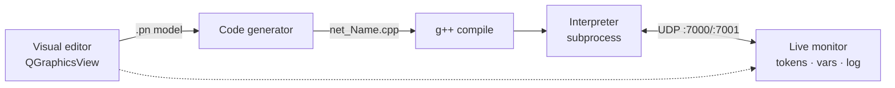
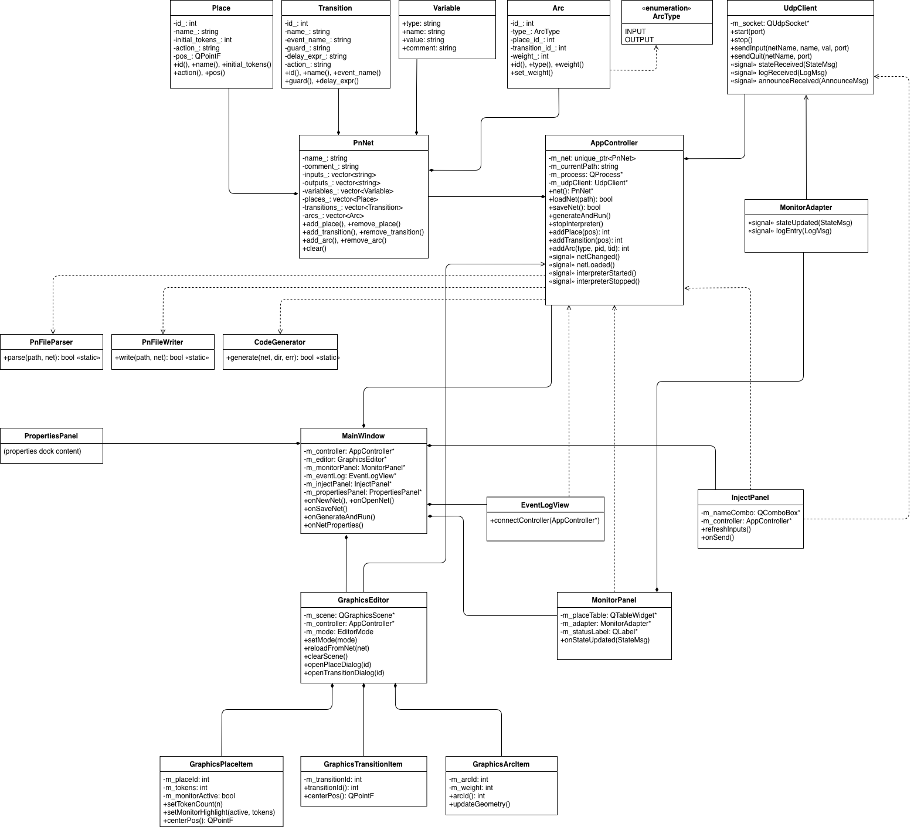

# Petri Net Studio

A desktop application for visually designing **event-driven Petri nets**, generating a
standalone C++ interpreter from them, running it, and monitoring its execution live.

Built as a team project for the ICP course (Object-Oriented Programming in C++) at BUT FIT.

> **Authors:** Samuel Fačka ([@faco1228](https://github.com/faco1228)) · Arťom Hanzel ([@artik03](https://github.com/artik03)) 
> &nbsp; · &nbsp; ~7,800 lines of C++17 / Qt 6



<p align="center">
  
  
</p>

*Left: live monitor with token counts and the event log. Right: a transition's properties —
its event, guard and C++ action.*

## What it does

You draw a Petri net on a canvas — places, transitions and weighted arcs — and give transitions
guards, input events, delays and C++ actions. From that model the app:

1. **Generates** a self-contained C++ interpreter for your specific net (`net_<Name>.cpp`)
2. **Compiles** it with `g++ -std=c++17`
3. **Runs** it as a subprocess and talks to it over **UDP**
4. **Monitors** it live — token counts, variable values, enabled transitions, and an event log,
   with enabled/pending transitions highlighted on the canvas



## Team

A two-person team project with [@artik03](https://github.com/artik03), built together over the semester.

## Features

- **Editor:** add/remove places & transitions, draw weighted directed arcs, edit properties of
  every element, manage net variables, save/load the `.pn` text format (full round-trip)
- **Execution:** one-click generate → compile → run; step mode (one maximal set of transitions
  per step) and auto mode (~200 ms); inject input events at runtime
- **Inscription language** (compiled into the interpreter): transition/place actions as inline
  C++, with built-ins `valueof()`, `defined()`, `output()`, `tokens()`, `elapsed()`, `now()`;
  delayed transitions (`@delay_ms`) with timers; deterministic firing order
- **Monitor:** live token/variable tables, enabled-transition list, color-coded canvas
  (green = enabled, orange = pending timer), event log, running/stopped status

## Build & run

Requirements: Qt 6 (Qt 5.15+ should work), a C++17 compiler, `pkg-config`.

```bash
make        # build (runs qmake + make in src/)
make run    # build and launch
make test   # .pn parser/writer round-trip test
make doxygen # generate API docs into doc/html/
make clean  # remove build products
```

## Examples

`examples/` contains ready-made nets: a simple token cycle, producer–consumer with a bounded
buffer, a semaphore with two competing processes, and timer (TOF) nets.

## Architecture

```
src/
  model/      net model + .pn parser/writer (PnNet, PnPlace, PnTransition, PnArc)
  codegen/    generator that emits the standalone C++ interpreter
  network/    UDP client for GUI <-> interpreter communication
  gui/        main window, QGraphicsView canvas, panels, dialogs, live monitor
  inc/        shared types and the UDP protocol
```



The full class diagram source is in `doc/` (`design.pdf`, `class_diagram.drawio`), and Doxygen
API docs can be generated with `make doxygen`.

## Known limitations

- After moving a node on the canvas, arc geometry may not refresh immediately in some cases
  (visual only, no effect on behaviour).
- `output()` takes `int64_t`, `string` and `const char*`; other numeric types must be cast.

## Note on AI assistance

Claude (Anthropic) was used during development as an assistant — for scaffolding Doxygen
comments, discussing class structure, debugging edge cases, and code review.
